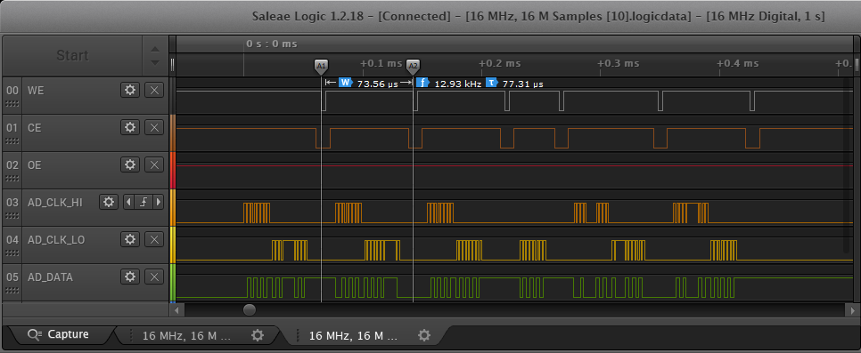

# Notes on 28C EEPROMs
The 28C series parallel EEPROMS, like the 28C256, support fast block writes and algorithms to implement Software Data Protection (SDP).  The SDP feature seems to be a leading cause of problems for people trying to program these chips with Arduino or other homebrew hardware.  

The first problem many people encounter is that new chips are often locked, even though the datasheet states that they should ship unlocked.  It isn't clear if the manufacturing practices have changed or if this might be due to used or conterfeit chips.  In any case, the chips may need to be unlocked before they can be programmed for the first time.

The unlock is accomplished by sending a sequence of bytes to specific addresses.  Many people have reported problems with this step when using DIY programmers. Some programmers may not be writing the SDP sequences quickly enough to successfully unlock the chips and yet others will report that the same hardware works correctly.  This may be due to variences in the behavior of chips from different manufacturers.

When writing SDP lock/unlock sequences, the datasheets note that the timing between bytes must follow the same restrictions as page writes.  In particular, the bytes must be written within the tBLC (Byte Load Cycle time).  On Atmel parts, this is specified as 150us max, so each write pulse must occur within 150us of the previous write.  The tBLC value is even shorter on the Xicor and ON Semi datasheets, stating that the writes must occur within 100us of each other.

In practice, the Xicor chips seem very forgiving of the timing, doing successful SDP and page write operations even when the tBLC is close to 200us.  Atmel chips, on the other hand, will refuse to unlock when the timing is outside the acceptable maximum.

# Solution

The TommyProm programmer uses direct port access on the Arduino to control the data bus and addressing shift register.  This is much faster than doing individual DigitalWrite calls and allows the unlock and page write code to run comfortably within the tBLC constraints.  It has been successfully tested with the following 28C256 chips:

* Atmel AT28C256-15PU
* Catalyst/ON Semi CSI CAT28C256P-12
* Xicor X28C256P-15
* Xicor X28C256P-25

The Atmel chips tested included a batch from eBay that may not have been genuine, but they were unlocked and burned successfully with the TommyProm code.

The capture below shows an unlock command sequence where the tBLC us within 80us for each byte.

# References

1. [Atmel AT28C256 Data Sheet, 0006M–PEEPR–12/09](http://ww1.microchip.com/downloads/en/DeviceDoc/doc0006.pdf)
1. [Xicor, Intersil, Renesas X28C256 Data Sheet, 3855-1.9 8/1/97 T1/C0/D8 EW](https://www.renesas.com/us/en/www/doc/datasheet/x28hc256.pdf)
1. [ON Semiconductor CAT28C256 Data Sheet, CAT28C256/D, December, 2009 − Rev. 6](https://www.onsemi.com/pub/Collateral/CAT28C256-D.PDF)
1. [Parallel EEPROM Data Protection Application Note, Atmel, Rev. 0543C–10/98](http://ww1.microchip.com/downloads/en/AppNotes/DOC0543.PDF)