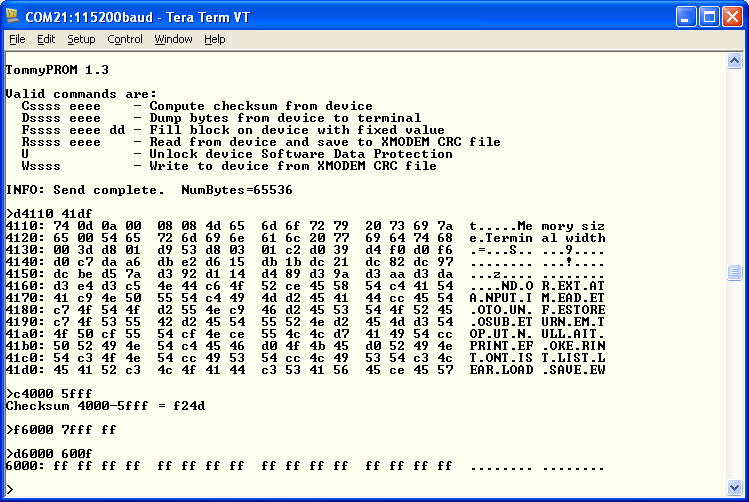

# TommyPROM - An Arduino-based EEPROM programmer
This is a simple EEPROM reader and programmer that can be assembled using an Arduino and a few additional parts.  It has been sucessfully built using the Arduino UNO, Micro, and Nano models.

The code is specific to the 28C256 32Kx8 EEPROM, but it would work, with some pin changes with other 5V EEPROMS as well.  The PROM-specific code is fairly modular and would be easily adapted.  Larger PROMs can be read or written in 64K chunks.  Many 5V chips, including UV EPROMs, such as the 2716, can be read with this hardware.

Features include:
* Simple hardware design that can be assembled on a breadboard.
* ROM images transfers using XMODEM - no special host client needed.
* Support for fast block EEPROM writes - a 32K chip will program is just a few seconds.

The project was inspired by the [MEEPROMMER programmer](http://www.ichbinzustaendig.de/dev/meeprommer-en).

## Hardware Design
The hardware uses an Arduino to write data and toggle to control lines with the appropriate timing to access the PROM.  A pair of 74LS164 serial to parallel shift registers latch the address lines.  Use of the shift registers allows the Arduino to control up to 16 address lines using only 3 output ports.

The basic circuit is as follows:
* Pins D2..D9 are wired to the data lines on the target PROM.
* Pins A0..A2 are wired to the WE, CE, and OE control lines on the target PROM.
* Pins A3..A5 control shift registers to produce the address lines.

The two shift registers can produce a sixteen bit address, although the 28C256 only needs 15 addresses.  Chips larger than 64K can be supported by manually tying the additional lines high or low and working with 64K blocks at a time.  Additional pins on the Arduino could also be directly tied to additional address lines to do bank selecting.

## Software Design

TBD

## Operation

To use the programmer, connect the Arduino USB to the host computer and run a terminal program, such as TeraTerm (Windows) or Minicom (Linux).  The Arduino development Serial Monitor can also be used as a terminal initially, but it does not support XMODEM transfers, so the READ and WRITE commands can't be used.

Set the terminal's serial parameters to 115200 baud, 8 bits, no parity, 1 stop bit to match the Arduino.  Press the Enter key.  If the connection is successful, TommyPROM will display a menu of options.

Most of the commands take a start address parameter, always entered as 4 hex characters.  If needed, the end address parameter is also 4 hex characters.  For example, the command:

    d0000 01ff

dumps memory from 0000H to 01ffH.  Note that commands and parameters can be entered in uppercase or lowercase.

The R command is used to read from a PROM and save a binary image on the host.  The W command receives a file from the host and writes (burns) it into the device.  The R command needs a start and end address.  The W command determines the end address from the received file size.

The READ and WRITE command both use XMODEM CRC to complete the file transfers.  Once the command is issued to the programmer, the transfer must be started on the host program.

## Further Work
The next project may be a PCB spin of the Nano design with a ZIF socket for easier access to the target chip.
