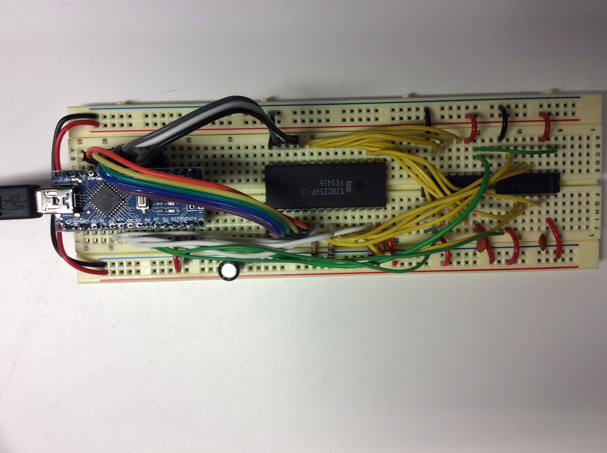

# TommyPROM - An Arduino-based EEPROM programmer
This is a simple EEPROM programmer and reader that can be assembled using an Arduino and a few additional parts.  It has been sucessfully built using the Arduino UNO, Micro, and Nano models.

The original code was specific to the 28C256 32Kx8 EEPROM, but it has been extended to also support Intel 8755A EPROMS.

The 28C design can be used with other 5V EEPROMS as well. Many 5V chips, including UV EPROMs, such as the 2716, 2764, 27C2001 and 27C040, can be read, but not written, with the basic hardware. Some pin changes may be needed to get the signals to the correct pins on the device.  See the [extension readme](README-extension.md) for details on suggested hardware and software changes needed to support new EPROM and EEPROM families.

The PROM-specific code is modular and can be easily adapted to support additional devices. There are currently drivers and hardware designs for 28C series EEPROMS and the Intel 8755A EPROM. Larger PROMs can be read or written in 64K chunks.

Features include:
* Simple hardware design that can be assembled on a breadboard.
* ROM images transfers using XMODEM - no special host client needed.
* Support for fast block EEPROM writes - a 32K EEPROM will program in just a few seconds.
* Modular software design to easily support other EEPROM and EPROM families.

The [hardware readme](hardware/README.md) has schematics and more information on the hardware design. The [software readme](TommyPROM/README.md) has class definitions and more information on the software design.

The project was inspired by the [MEEPROMMER programmer](http://www.ichbinzustaendig.de/dev/meeprommer-en).

## Compiling

Open the TommyPROM.ino file in the Arduino IDE. It should automatically open the cpp and h files as well. The default code programs 28C series chips using Arduino Nano hardware.  To use this version, just compile and upload it to the Arduino.

For different Arduino hardware, like UNO or Micro, edit the Configure.h file and uncomment the appropriate ARDUINO_IS_xx line. Only one of these lines should be uncommented. If all of these lines are commented out, the generic bit-at-a-time code is used to write to the data bus. This will work on all Arduinos, but it is slower that the model-specific code.

To use the 8755A version of the code and matching hardware, uncomment PROM_IS_8755A and comment out the other PROM_IS_xx choices.

## Operation

To use the programmer, connect the Arduino USB to the host computer and run a terminal program, such as TeraTerm (Windows) or Minicom (Linux).  The Arduino development Serial Monitor can also be used as a terminal initially, but it does not support XMODEM transfers, so the READ and WRITE commands can't be used.

Set the terminal's serial parameters to 115200 baud, 8 bits, no parity, 1 stop bit to match the Arduino.  Press the Enter key.  If the connection is successful, TommyPROM will display a menu of options.

Most of the commands take a start address parameter, always entered as 4 hex characters.  If needed, the end address parameter is also 4 hex characters.  For example, the command:

    d0000 01ff

dumps memory from 0000H to 01ffH.  Note that commands and parameters can be entered in uppercase or lowercase.

The R command is used to read from a PROM and save a binary image on the host.  The W command receives a file from the host and writes (burns) it into the device.  The R command needs a start and end address.  The W command determines the end address from the received file size.

The READ and WRITE command both use XMODEM CRC to complete the file transfers.  Many terminal programs default to XMODEM Checksum format, so be sure to select XMODEM CRC as the format. Once the READ or WRITE command is issued to the programmer, the transfer must be started on the host program.

The files used for READ and WRITE are simple binary images. This can be created directly by [asm85](http://github.com/TomNisbet/asm85) or can be converted from S-record or Intel HEX using an external utility.

## Further Work
* Add a new PromDevice class for 27 series EPROMS.
* Additional error checking in the CmdLine code.
* Extend the addressing code to use a U32 instead of a U16 to allow chips larger than 64K to be programmed in a single operation.
