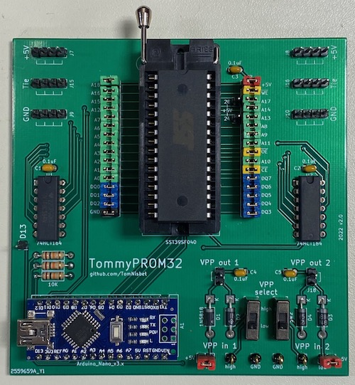
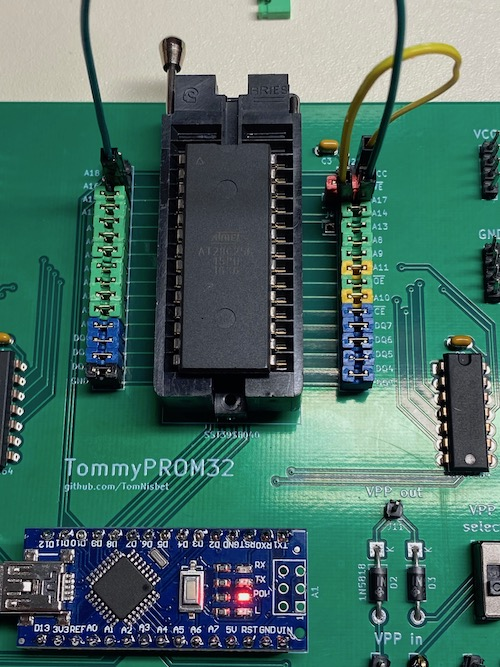

Although it was originally designed as a one-off programmer to be used on a breadboard,
there are now some PCB versions.

## 28C256 PCB

A PCB version for the 28C256 and 28C64 chips was built to support a SAP-1 TTL breadboard
computer.  This project required a lot of burns for its  microcode and the PCB version
with the ZIF socket was much quicker than prying the chips out of a breadboard without
disturbing any of the wires.

The [KiCad design files](https://github.com/TomNisbet/TommyPROM/tree/master/schematics)
are in the project repo.

## TommyPROM32

TommyPROM32 was built to support SST39SF0x0 and other 32-pin EEPROM and Flash chips. While
providing a stable platform for the SST39SF chips, the board can serve as a test bed for
other chips as well.  It uses a set of headers that allow any of the signals to the target
chip to be re-routed.  The default configuration, with just jumper shunts installed, is
wired for the SST39SF0x0 chips.

Many other chips, particularly if they follow JEDEC standards, can be supported by
removing shunts and adding just a few jumper wires.

Chips with fewer pins can also be supported.  There are power pins in place to support
28-pin and 24-pin chips with a shunt to the correct VCC pin.  The photo below shows the
28C256 with a power jumper on pin 28, the _WE_ signal moved down to pin 27, and the _A14_
signal moved from ping 27 to pin 1.

Power inputs and a switch are provided to support older flash and EEPROM chips that need
higher programming voltages.  Many of these chips just need a higher voltage, like 12V,
applied to the VPP pin continuously during the programing and verification cycle.  In
normal operation, the 5V VCC signal is applied to the VPP pin.  The board has VPP inputs
for two voltages.  Applying 12V to _VPP In High_ and 5V to _VPP In Low_ lets the VPP
output be switched between these two voltages using a manual slide switch for programming.

The photo below shows the WE27C257 set up for programming.  The _VPP in Low_ signal is
connected to _VCC_ and the _VPP in High_ signal is using 12V from an external power
supply. The _VPP Out_ signal is connected to the chip's VPP on pin 1.  The chip is in
programming mode when the slide switch is set to the _High_ position and is in read mode
when in the _Low_ position.

To erase the WE27C257 chip, the external power supply is providing 14V and the _VPP Out_
is connected to the chip's _VPP_ and _A9_ pins.  An external breadboard was needed to
allow the _VPP Out_ signal to be connected to multiple pins.  A new spin of the board is
planned with multiple _VPP Output_ pins and some general-purpose interconnect pins.

For chips that require a high voltage VPP pulse during programming, some external
switching circuitry will be needed to allow the Arduino to control the VPP voltage.  There
is a header connected to the unused D13 pin that can support this.  See the
[Intel 8755 version of the hardware](hardware/#intel-8755a-hardware-version) for an
example of voltage switching by TommyPROM.
