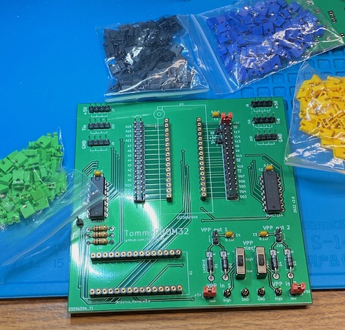
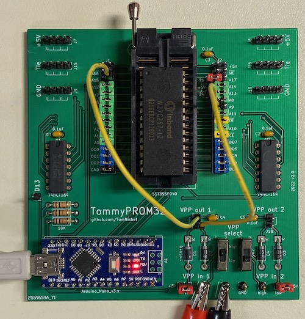

## TommyPROM32

TommyPROM32 was built to support 32-pin and smallerr EEPROM and Flash chips. While providing a stable platform for the SST39SF chips, the board can be easily configured for many other chips as well.  It uses a set of headers that allow any of the signals to the target chip to be re-routed.  

The default configuration, with just jumper shunts installed, is wired for the SST39SF0x0 chips.

Many other chips, particularly if they follow JEDEC standards, can be supported by removing shunts and adding just a few jumper wires.

Note that some of the photos below show the initial version of the TommyPROM32 board that only contained a single switchable voltage.  The version 2.0 boards added a second switchable Vpp voltage section with multiple _VPP Output_ pins.  The _5V_ and _Vpp in low_ pins are now adjacent so that a wire is not needed for the common case where Vpp low is set to 5V.  There are also some general-purpose 5v, GND, and interconnect pins.

Chips with fewer pins can also be supported.  There are power pins in place to support 28-pin and 24-pin chips with a shunt to the correct VCC pin.  The photo below shows the 28C256 with a power jumper on pin 28, the _WE_ signal moved down to pin 27, and the _A14_ signal moved from ping 27 to pin 1.

## Vpp Power Selection Examples

Two power inputs and switches are provided to support older flash and EEPROM chips that need higher programming voltages.  Many of these chips just need a higher voltage, like 12V, applied to the VPP pin continuously during the programing and verification cycle.  In normal operation, the 5V VCC signal is applied to the VPP pin.  The board has VPP inputs for two voltages.  Applying 12V to _VPP In High_ and 5V to _VPP In Low_ lets the VPP output be switched between these two voltages using a manual slide switch for programming.

### WE27C257 

The photo below shows the WE27C257 set up for programming.  The _VPP in Low_ signal is connected to _VCC_ and the _VPP in High_ signal is using 12V from an external power supply. The _VPP Out_ signal is connected to the chip's VPP on pin 1.  The chip is in programming mode when the slide switch is set to the _High_ position and is in read mode when in the _Low_ position.

To erase the WE27C257 chip, the external power supply is providing 14V and the _VPP Out_ is connected to the chip's _VPP_ and _A9_ pins.  

### M27C256
The M27C256 chip needs two voltages for programming.  The external power supply is providing 12.75V to _VPP Out 1_ for the the chip's _VPP_ and _A9_ pins.  The power supply is also providing 6.25V to _VPP Out 2_ for the chips _Vcc_.  Note the the chip's Vcc is no longer connected to the system +5V.  The two VPP Select switches should be in the _low_ lowition for normal read operation and in the _high_ position for programming.

## High Voltage Pulses

For chips that require a high voltage VPP pulse during programming, some external switching circuitry will be needed to allow the Arduino to control the VPP voltage.  There is a header connected to the unused D13 pin that can support this.  See the [Intel 8755 version of the hardware](hardware/#intel-8755a-hardware-version) for an example of voltage switching by TommyPROM.

## Schematics and Gerbers

The [KiCad design files](https://github.com/TomNisbet/TommyPROM/tree/master/schematics)
are in the project repo.

