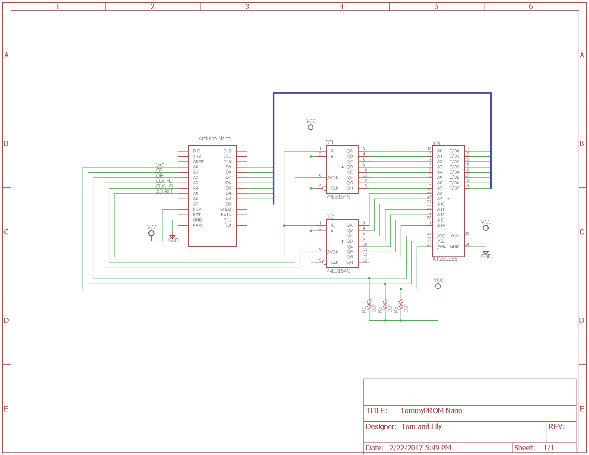

# Hardware Design

# Basic Hardware Version
The hardware uses an Arduino to write data and to toggle control lines with the appropriate timing to access the PROM.  A pair of 74LS164 serial to parallel shift registers latch the address lines.  Use of the shift registers allows the Arduino to control up to 16 address lines using only 3 output ports.

The basic circuit is as follows:
* Pins D2..D9 are wired to the data lines on the target PROM.
* Pins A0..A2 are wired to the WE, CE, and OE control lines on the target PROM.
* Pins A3..A5 control shift registers to produce the address lines.

The two shift registers can produce a sixteen bit address, although the 28C256 only needs 15 addresses.  Chips larger than 64K can be supported by manually tying the additional lines high or low and working with 64K blocks at a time.  Additional pins on the Arduino could also be directly tied to additional address lines to do bank selecting.

# Intel 8755A Hardware Version

The Intel 8755A uses a multiplexed data and address bus, plus 3 additional address lines. Most Arduino hardware has enough pins to support this directly, so no addtional hardware is needed for addressing. An Arduino pin is also used to drive the ALE latch pin.

The 8755A requires the Vdd pin to be be switched between 5V and 25V during the programming of each byte. A simple transistor circuit is used for this. No voltage regulator circuit is present here for the programming voltage. Because this is designed as a quickly assembled hardware design, a triple output bench supply was used to provide the 25.5V, 5.5V and 5V outputs.

